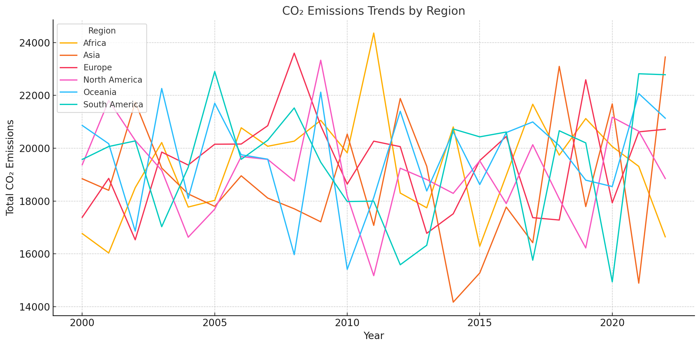

# CO2_Emissions
An analysis of CO2 emissions by industry, country, year, etc.

## Tools and Technologies
- **SQL**: Querying and transforming raw data.
- **Excel**: Summarizing and visualizing results.

## Key Skills Demonstrated
- Data querying and aggregation with SQL.
- Data cleaning and preparation for analysis.
- Deriving actionable insights from raw data.
- Presentation of results in a clear, concise format.

## Repository Structure
- **SQL Files**: Located in the root directory and named descriptively.
- **Results Files**: Corresponding `.csv` files containing query outputs.
- **Cleaned Dataset**: Processed file ready for analysis.

# Data Cleaning Steps

### 1. Column Standardization
- Renamed columns to `snake_case` for consistency.

### 2. Duplicate Removal
- Removed duplicate rows to ensure data integrity.

### 3. Data Standardization
- Standardized values in categorical columns:
  - `industry_type`
  - `region`
  - `country`

### 4. Outlier Detection
- Identified potential outliers using z-scores; no significant issues were found.

### 5. Derived Metrics
- Created new fields:
  - `co2_emissions_per_capita`: CO2 emissions divided by population.
  - `energy_consumption_per_capita`: Energy consumption divided by population.
  - `renewable_energy_contribution`: Contribution of renewable energy in TWh.

### 6. Sorting
- Sorted dataset by `year`, `region`, and `country` for clarity.

### 7. Final Export
- Saved the cleaned dataset as `cleaned_co2_emissions_by_sectors.csv`.

## Analysis Reasoning

## Project
### 1. **Yearly Emissions by Region**
- **SQL Query**: [`Emissions by Region and Year.sql`](./Emissions by Region and Year.sql)
- **Results**: [`Emissions by Region and Year Results.csv`](./Emissions by Region and Year Results.csv)
- **Visualization**: 
- **Description**: This 
